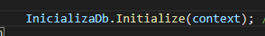
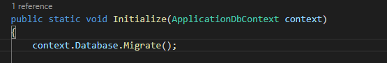
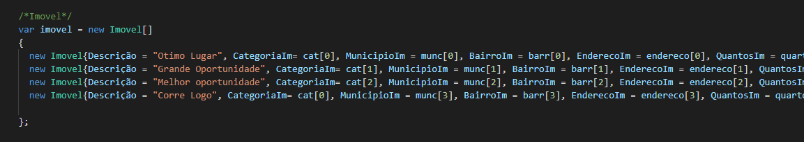
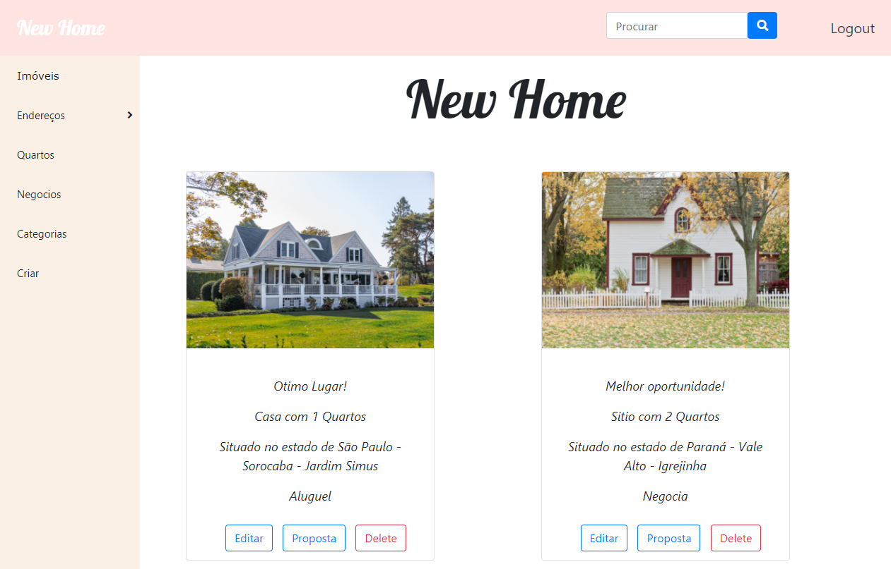
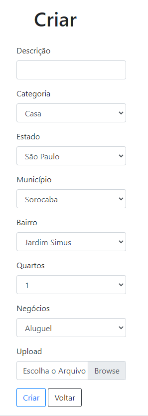
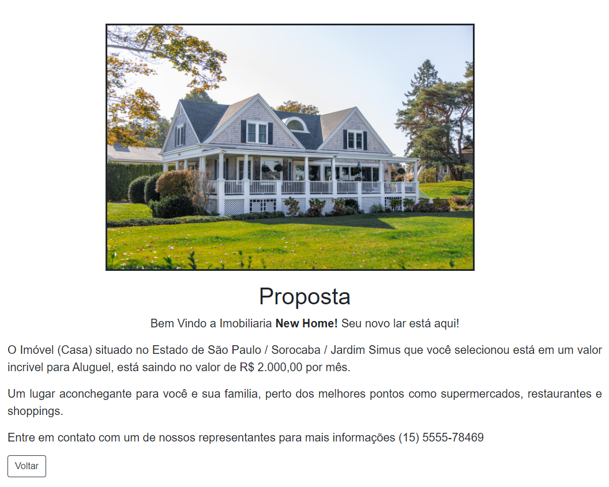

#   Projeto MVC Imóbiliaria - GFT Technologies AG 

Este projeto foi desenvolvido como parte do Estágio.
Utilizando conceitos do Asp .Net Core MVC Identity, foi proposto a criação de um site (imóbiliaria)  com Crud para manipulação de diversos elementos que compõem a estrutra do site. Seguindo algumas regras definidas no escopo do projeto e criado algumas funcionalidades extras.

*CPF para acesso de administrador*: 00010

## Estrutura
- Para subir a aplicação *não é necessário realizar o migrations-update*, no método Configure() foi passado o contexto e a classe InicializaDb irá utilizar os migrations já existentes e irá subir todo banco de dados.
 

 - Foi criado a classe InicializaDb com  o Método Initialize tanto para criar banco de dados e suas tabelas, como para popular o banco com alguns objetos e infomações. Passando como parâmetro a classe de contexto e método Migrate() para então utilizar das migrations existentes. *É um pouco demorado para subir a aplicação, pois ele cria o banco e popula*.
 

 

- Foi criado uma Claim para CPF e será utilizada para criar uma autorização de acesso as funcionalidades do sistema.
  Para agilizar o preenchimento do cadastro durante os testes será utilzado o CPF: 00010.

## Casos de Uso Administrador

Será descrito como o administrador irá manipular cada aspecto do sistema, também será mostrado a lógica de desenvolvimento do sistema.

A primeira tela é a de login, clique em Registrar e coloque as informações solicitadas. Após o cadastro será direcionado para tela principal já logado.

 
 
 O administrador tem acesso a tela principal com todos os objetos já cadastrados e com a possibilidade de editar e deletar os Imóveis.
Na barra lateral tem a possibilidade de navegar entre as diversas classes e seguindo e utilizando CRUD ele poderá manipular cada uma delas.
Após cadastrar cada classe ele terá que criar o Imóvel completo para exibição na página principal. Na aba lateral tem a opção <strong>Criar</strong>, utilizada apenas para classe imóvel, poderá ser montado o imóvel por meio de select list com cada definição e adicionar uma foto.O Select list utilizado não está em Cascading DropDownList, mas em relacionamento de 1: N e 1:1. 
Por fim o imóvel completo será exibido na página principal para o usuário.
O Select list
 

 
 

- Ao criar a imagem é salva na pasta wwroot/imagem.

- Na opção editar há a possibilidade de substituir a imagem, porém é necessário passar o nome da imagem com a extensão, com a imagem devidamente localizada na pasta wwroot/imagem. 

- A barra de busca localiza qualquer imóvel menos pelo atributo quantidade de quartos, porém todos os outros atributos ele localiza. Utiliza de case sensitive sendo necessário escrever a busca do mesmo jeito que foram criadas os atributos.

- O conjunto de informações de cada Card é preenchido automaticamente com base nos objetos e atributos escolhidos ao criar o Imóvel.

- Titulo da imobiliaria no cabeçalho direciona para página principal de imóveis ao ser clicada.

## Casos de Uso Usuário

- O usuário realiza todos os passos para registrar seu acesso, ao logar é direcionado para página principal, visualizando todos os cards com as ofertas de imóveis.
- O usuário não tem acesso a nenhuma página a não ser a página imóvel, ao clicar em alguma página ele recebe um aviso de acesso negado.
- No card de cada imóvel o usuário não pode editar nem deletar nenhuma informação, encontrado acesso negado ao clicar.

### Proposta
- O usuário ao clicar no botão <strong>Proposta</strong> será direcionado a uma página com algumas informações extras(como valor do imóvel), além da apresentação da imóbiliaria, há algumas informações de contato para dar prosseguimento na compra do imóvel.

- No sistema a proposta é alterada pela opão de Aluguel ou Compra, foi criado na view *Contrato* um If-Else para essas duas opções e um else para opções adicionais. Aluguel e Compra possui sensitive case.

- A opção de imóvel, valores, negocios e localidade mudam de acordo com o cadastro realizado no imóvel, e a escolha de cada card pelo usuário.

 

